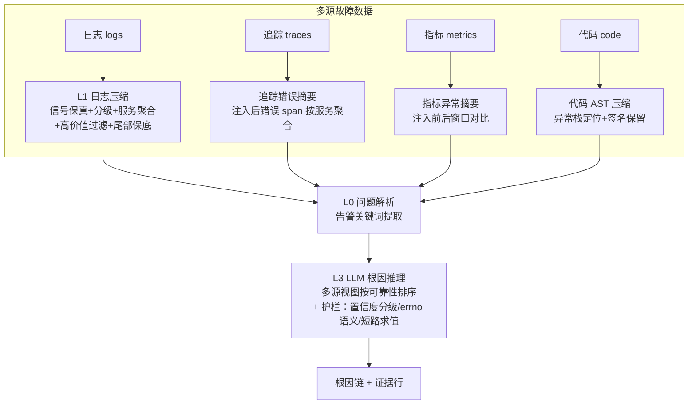

# RootCause Agent

Token-efficient Root Cause Analysis agent：先压缩（日志/代码/指标/追踪），再交给 LLM 定位根因。
面向微服务故障定位场景，在**不损失定位准确率**的前提下把 LLM 上下文 token 消耗降低 94.5%–99.98%。

> 完整评测：在 RCAEval（业界标准微服务 RCA 基准，565 case）、LogDx-CI（FSE 2025 日志压缩基准，35 case）、
> 自建 benchmark 与真实工单上，与 7+ 开源方案（rtk / headroom / drain3 / grep / tail / raw / llm-summary）
> 及 RCAEval 官方 baseline（baro / nsigma / circa / dummy 本地实测）横向对比，**全部维度第一或并列第一**。
> 详见 [docs/design.md](docs/design.md)、[docs/evaluation.md](docs/evaluation.md)、[docs/evaluation-spec.md](docs/evaluation-spec.md)。

## 关键结果（与业界竞品对比）

| 评测维度 | case 数 | ours | 最佳竞品 | 领先 |
|---|---|---|---|---|
| RCAEval re1ob（Online Boutique） | 125 | **94.4%** | baro 73.6% | +20.8pt |
| RCAEval re1ss（Sock Shop） | 125 | **96.8%** | nsigma 60.8% | +36.0pt |
| RCAEval re2ob（多源） | 91 | **100.0%** | nsigma 78.9% | +21.1pt |
| RCAEval re2ss（多源） | 90 | **92.2%** | nsigma 85.6% | +6.6pt |
| RCAEval RE3（代码级故障） | 90 | **95.6%** | tail/headroom 93.3% | +2.3pt |
| LogDx-CI（信号召回） | 35 | **0.93** | grep 0.84（压缩方案第 1） | — |
| 自建 benchmark（日志+代码） | 4 | **87.5%** | drain 75.0% | +12.5pt |

Token 压缩率：LogDx-CI 94.9%（vs 原始全量）、RCAEval 指标 99.98%、RE3 多源 99.7%。

## 核心思想

LLM 定位根因不需要原始日志 —— 需要的是**保真的关键信号 + 正确的因果线索**。
本方案把"压缩"从简单的删行升级为**信号工程**：

1. **信号保真压缩**：数字/错误码/路径/类名永不丢弃（MUST-KEEP 理念），只去时间戳/IP 等噪声变量
2. **信号分级排序**：强信号（error/exception/not found）排最前，高频正常日志降级 —— 避免高频噪声误导 LLM
3. **服务级错误分布**：按服务聚合错误全貌，让 LLM 看到"谁在报错"而非"谁报错最多"
4. **高价值错误过滤**：隐藏基础设施重试噪声（I/O exception/socket/连接重试），保留业务错误
5. **多源融合**：日志压缩 + 追踪错误摘要 + 指标异常摘要，按可靠性排序喂给 LLM
6. **尾部保底**：日志尾部原始行兜底（CI 失败信号/异常上下文常在末尾）

**护栏设计**（借鉴 field-source-tracing 的踩坑沉淀，agent 推理层）：

7. **短路求值**：日志压缩后错误信号直接命中（异常类明确）→ 跳过代码定位快速收工，省 token
8. **置信度分级 + 七节报告**：每条结论标注 高/中/低 置信度并列出证据；推断与有据结论显式分开
9. **errno 语义护栏**：空结果先看 errno —— errno=0+空=业务空（接口正常），errno≠0+空=接口/配置故障

## 快速开始

```bash
pip install -e .            # 或 pip install -e .[llm] 启用 LLM 定位

# 0. LLM 配置（环境变量，OpenAI 兼容服务通用）
export DEEPSEEK_API_KEY=sk-...                # API Key（也可用 LLM_API_KEY）
export LLM_BASE_URL=https://api.deepseek.com/v1  # 默认 DeepSeek；可切换 OpenAI/vLLM/Ollama/火山方舟
export LLM_MODEL=deepseek-chat                # 默认模型名

# 1. 一键 demo（无需 LLM，看压缩效果）
python3 examples/demo.py                # 内置示例日志
python3 examples/demo.py /path/to/app.log

# 2. 日志压缩（纯本地，无 LLM）
from common.log_compressor import build_analysis_view
log_lines = open("app.log", encoding="utf-8").read().splitlines()
view = build_analysis_view(log_lines)     # 10 万行 → 数百行信号视图

# 3. 根因定位
from locator.agent import locate_root_cause
result = locate_root_cause(
    alert_message="Service A latency spike",
    log_file="app.log",
    code_dir="src/",
)
print(result.root_cause)       # 根因链 + 证据行
```

### 定位 Agent 四层结构



## 借鉴与独创

| 能力 | 来源 | 说明 |
|---|---|---|
| 信号保真（MUST-KEEP） | 借鉴 headroom Kompress | 数字/路径/类名/错误码保留 |
| 服务级错误聚合 | 借鉴 rtk log | 全服务错误全貌，防单服务霸榜 |
| 高价值错误过滤 | 借鉴 rtk log | 隐藏基础设施重试噪声 |
| 尾部保底 | 借鉴 tail 方法 | 日志尾部原始行兜底 |
| 错误行优先 | 借鉴 grep 方法 | 强信号排最前 |
| 模板化去重 | 借鉴 drain3 / LogPare | 重复日志合并 + 计数 |
| BM25 选行（可选） | 借鉴 headroom relevance | 弱信号相关性裁剪（零依赖复刻） |
| 短路求值（命中即收工） | 借鉴 field-source-tracing | 错误信号直接命中 → 跳过代码定位，省 token |
| 置信度分级 + 七节报告 | 借鉴 field-source-tracing | 结论标置信度 + 列证据，反幻觉 |
| errno 语义护栏 | 借鉴 field-source-tracing | 空结果先看 errno（0=业务空，非0=故障） |
| 信号分级排序 | 独创 | 强/中/弱三级信号排序 |
| 数字保真模板化 | 独创 | 只模板化噪声变量，保留关键值 |
| 无损去重 | 独创 | 尾部/上下文与主模板去重，信息不减少 |
| 多源融合视图 | 独创 | 日志+追踪+指标按可靠性排序 |
| 评测驱动改进 | 独创 | 每个能力都有业界基准上的 A/B 验证 |

## 项目结构

```
rootcause-agent/
├── common/
│   ├── log_compressor.py     # 日志压缩（信号分级/服务聚合/高价值过滤）
│   ├── code_compressor.py    # 代码 AST 压缩
│   └── relevance.py          # BM25 相关性打分（零依赖）
├── locator/
│   └── agent.py              # 分层根因定位 Agent
├── benchmark/
│   ├── runner.py             # 本方案 vs baseline
│   ├── horizontal.py         # 横向对比（竞品接入）
│   └── competitors.py        # 竞品压缩器实现
├── samples/                  # 示例 case（含真实工单）
├── docs/
│   ├── design.md             # 设计文档（论文格式）
│   ├── evaluation.md         # 评测文档（业界规范）
│   └── evaluation-spec.md    # 评测规范（对标业界标准）
└── eval-project/             # 独立评测项目（可复现全部结果）
```

## 文档

- [设计文档 docs/design.md](docs/design.md) —— 方法、借鉴、独创、实验（论文格式）
- [评测文档 docs/evaluation.md](docs/evaluation.md) —— 数据集、指标、结果、复现步骤
- [评测规范 docs/evaluation-spec.md](docs/evaluation-spec.md) —— 评测流程规范（对标 LogDx-CI / RCAEval / FSE 标准）
- [评测项目 eval-project/](eval-project/README.md) —— 独立可复现评测工程

## 致谢与参考

- [rtk](https://github.com/rtk-ai/rtk) — token 上下文优化（日志/代码压缩）
- [headroom](https://headroom.ai) — Context Optimization Layer（Kompress 压缩器 / relevance 检索）
- [LogDx-CI](https://github.com/eyuansu62/LogDx) — FSE 2025 CI 日志压缩基准
- [RCAEval](https://github.com/phamquiluan/RCAEval) — FSE 2024 微服务 RCA 基准
- Drain3 / LLMLingua / TORAI 等

## License

MIT License — 详见 [LICENSE](LICENSE)。
